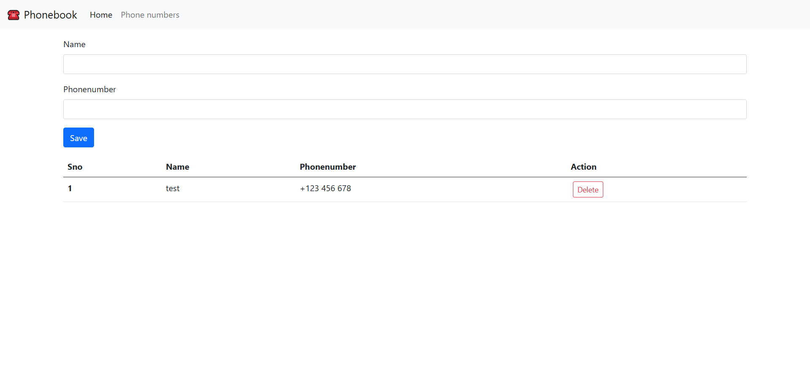
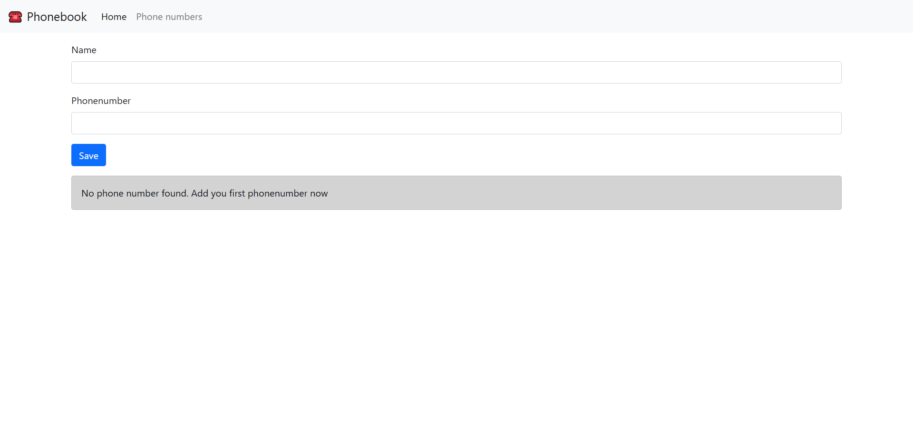

# Phone Book
- This is python-flask based website application where you can store your phone numbers with name and also you can delete it

### To run this code in Linux

```sh
pip3 install -r requirements.txt
```

```sh
python3 -m venv .venv
```

```sh
source .venv/bin/activate
```

```sh
python3 app.py
```

## To run on Windows

```sh
pip install -r requirements.txt
```

```sh
python3 -m venv .venv
```

```sh
.venv\Scripts\activate
```

## Screenshots


